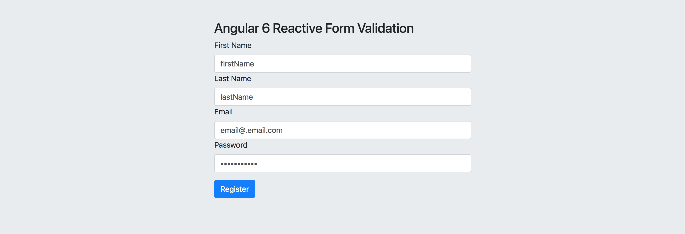
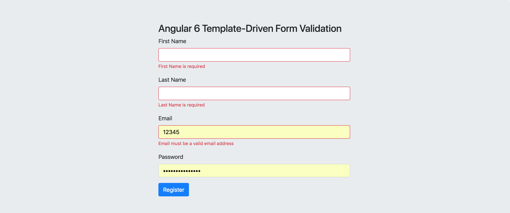

# Validation Example In Angular

## Based on angular 6.x, describe the usage of validation in angular reactive form and template driven form

## CSS rely on bootstrap 4.1.1

## What is this?

> This is a quick start example for setting up validation in Angular6 using reactive forms and template driven from

### Reactive Form

> The example is a simple registration form with pretty standard fields for first name, last name, email and password. All fields are required, plus the email field must be a valid email address and the password field must have a min length of 6.
  
> The example setup the form to validate on submit rather than as soon as each field is changed. This is implemented with a 'submitted' field in the app component that is set to true when the form is submitted for the first time.

> component defines the form fields and validators for our reactive registration form using an `Angular FormBuilder` to create an instance of a `FormGroup` that is stored in the registerForm property. The registerForm is then bound to the form in the template below using the `[formGroup]` directive.

```typescript
import { Component, OnInit } from '@angular/core';
import {FormBuilder, FormGroup, Validators} from '@angular/forms';

@Component({
  selector: 'app-reactive',
  templateUrl: './reactive.component.html',
  styleUrls: ['./reactive.component.css']
})
export class ReactiveComponent implements OnInit {
  registerForm: FormGroup;
  submitted = false;
  constructor(
    private fb: FormBuilder
  ) { }

  ngOnInit() {
    this.registerForm = this.fb.group({
      firstName: ['firstName', Validators.required],
      lastName: ['lastName', Validators.required],
      email: ['email@.email.com', [Validators.required, Validators.email]],
      password: ['password123', [Validators.required, Validators.minLength(6)]]
    });
  }
  // convenience getter for easy access to form fields
  get f() {
    return this.registerForm.controls;
  }
  // validation will trigger after click the submit event
  onSubmit() {
    this.submitted = true;
    if (this.registerForm.invalid) {
      return;
    }
    alert('form submit success');
  }
}
```



> The form binds the form submit event to the `onSubmit()` handler in the reactive component using the Angular event binding `(ngSubmit)="onSubmit()"`. 

> Validation messages are displayed only after the user attempts to submit the form for the first time, this is controlled with the submitted property of the reactive component


### template driven form

> validation is implemented using the `f.submitted` property of the `#f="ngForm"` template variable which is true after the form is submitted for the first time.

> The form input fields use the `[(ngModel)]` directive to bind to properties of the model object in the template driven form component. 

> Validation is implemented using the attributes `required`, `minlength` and `email`, the Angular framework contains directives that match these attributes with built-in validator functions.
  
```typescript
import { Component, OnInit } from '@angular/core';

@Component({
  selector: 'app-template',
  templateUrl: './template.component.html',
  styleUrls: ['./template.component.css']
})
export class TemplateComponent implements OnInit {
  model: any = {};
  constructor() { }

  ngOnInit() {
  }
  onSubmit() {
    alert('template driven form submitted!\n\n' + JSON.stringify(this.model));
  }
}
```



## Conclusion

> Even though there is personality of using reactive form or template form, but from my perspective, always using reactive form instead of template form, 

> The majority reason for using reactive form is, it is more easier to watch the model level for the component, the code structure is more like from model to view, reduce the coupling between the view and model

> But in a word, it is personal idea but big issue
